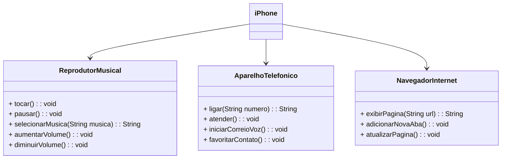

# [Dio](https://dio.me/) - Desafio POO
---
# **Autores**
- [Igor Trindade](https://www.linkedin.com/in/igorttrindade/)

---
## Contexto
Foi pedido a criação do driagrama UML do primeiro iPhone, de acordo com vídeo de seu lançamento.

- [Lançamento do iPhone 2007](https://www.youtube.com/watch?v=9ou608QQRq8)

### Ferramentas
Para a conclusão desse desafio, utilizei a plataforma [Draw.io](https://app.diagrams.net/), com as formas UML e UML 2.5.

### Diagrama
Na ferramenta citada a cima criei o seguinte diagrama.

### Diagrama utilizando Mermaid

> :memo: **Obs:** Este é um repositório com fins acadêmicos, fique avontade para utiliza-lo 🫡.
